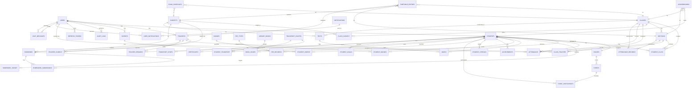

# Entity Relationship Diagram

```mermaid
erDiagram
    USERS ||--o{ STUDENTS : "has"
    USERS ||--o{ TEACHERS : "has"
    USERS ||--o{ PARENTS : "has"
    USERS ||--o{ AUDIT_LOGS : "performs"
    USERS ||--o{ REFRESH_TOKENS : "owns"
    
    STUDENTS }o--|| HOUSES : "belongs_to"
    STUDENTS ||--o{ STUDENT_PARENT : "has"
    PARENTS ||--o{ STUDENT_PARENT : "has"
    
    STUDENTS ||--o{ STUDENT_CLASS : "enrolled_in"
    CLASSES ||--o{ STUDENT_CLASS : "contains"
    SECTIONS ||--o{ STUDENT_CLASS : "contains"
    
    CLASSES ||--o{ SECTIONS : "has"
    CLASSES ||--o{ CLASS_SUBJECT : "offers"
    SUBJECTS ||--o{ CLASS_SUBJECT : "taught_in"
    
    TEACHERS ||--o{ TEACHER_SUBJECT : "teaches"
    SUBJECTS ||--o{ TEACHER_SUBJECT : "taught_by"
    
    CLASSES ||--o{ CLASS_TEACHER : "assigned"
    SECTIONS ||--o{ CLASS_TEACHER : "assigned"
    TEACHERS ||--o{ CLASS_TEACHER : "assigned_to"
    
    STUDENTS ||--o{ ATTENDANCE : "has"
    CLASSES ||--o{ ATTENDANCE : "records"
    SECTIONS ||--o{ ATTENDANCE : "records"
    USERS ||--o{ ATTENDANCE : "marked_by"
    
    CLASSES ||--o{ ATTENDANCE_RECORDS : "summarizes"
    SECTIONS ||--o{ ATTENDANCE_RECORDS : "summarizes"
    
    HOMEWORK ||--o{ HOMEWORK_TARGET : "targets"
    HOMEWORK ||--o{ HOMEWORK_SUBMISSIONS : "has"
    STUDENTS ||--o{ HOMEWORK_SUBMISSIONS : "submits"
    SUBJECTS ||--o{ HOMEWORK : "for"
    TEACHERS ||--o{ HOMEWORK : "creates"
    
    TESTS ||--o{ MARKS : "has"
    STUDENTS ||--o{ MARKS : "receives"
    SUBJECTS ||--o{ TESTS : "for"
    CLASSES ||--o{ TESTS : "conducted_in"
    
    NOTIFICATIONS ||--o{ USER_NOTIFICATIONS : "sent_to"
    USERS ||--o{ USER_NOTIFICATIONS : "receives"
    
    LEADERBOARDS }o--|| STUDENTS : "ranks"
    LEADERBOARDS }o--|| CLASSES : "for"
    LEADERBOARDS }o--|| SECTIONS : "for"
    
    STUDENTS ||--o{ STUDENT_BADGES : "earns"
    BADGES ||--o{ STUDENT_BADGES : "awarded"
    STUDENTS ||--o{ ACHIEVEMENTS : "has"
    STUDENTS ||--o{ STUDENT_STREAKS : "tracks"
    
    TIMETABLE_ENTRIES }o--|| CLASSES : "for"
    TIMETABLE_ENTRIES }o--|| SECTIONS : "for"
    TIMETABLE_ENTRIES }o--|| SUBJECTS : "teaches"
    TIMETABLE_ENTRIES }o--|| TEACHERS : "assigned"
    
    STUDENTS ||--o{ FEE_RECORDS : "pays"
    FEE_TYPES ||--o{ FEE_RECORDS : "categorized_as"
    
    EVENTS ||--o{ EVENT_PARTICIPANTS : "includes"
    STUDENTS ||--o{ EVENT_PARTICIPANTS : "participates"
    HOUSES ||--o{ EVENTS : "hosts"
    
    STUDENTS ||--o{ BOOK_ISSUES : "borrows"
    LIBRARY_BOOKS ||--o{ BOOK_ISSUES : "issued"
    
    TRANSPORT_ROUTES ||--o{ TRANSPORT_STOPS : "has"
    STUDENTS ||--o{ STUDENT_TRANSPORT : "uses"
    TRANSPORT_ROUTES ||--o{ STUDENT_TRANSPORT : "assigned"
    
    USERS ||--o{ CHAT_MESSAGES : "sends"
    USERS ||--o{ CHAT_MESSAGES : "receives"
    
    STUDENTS ||--o{ TEACHER_REMARKS : "receives"
    TEACHERS ||--o{ TEACHER_REMARKS : "writes"
    
    STUDENTS ||--o{ STUDENT_GOALS : "sets"
    STUDENTS ||--o{ CERTIFICATES : "earns"
    
    EXAM_SCHEDULES }o--|| CLASSES : "for"
    EXAM_SCHEDULES }o--|| SUBJECTS : "in"
```
